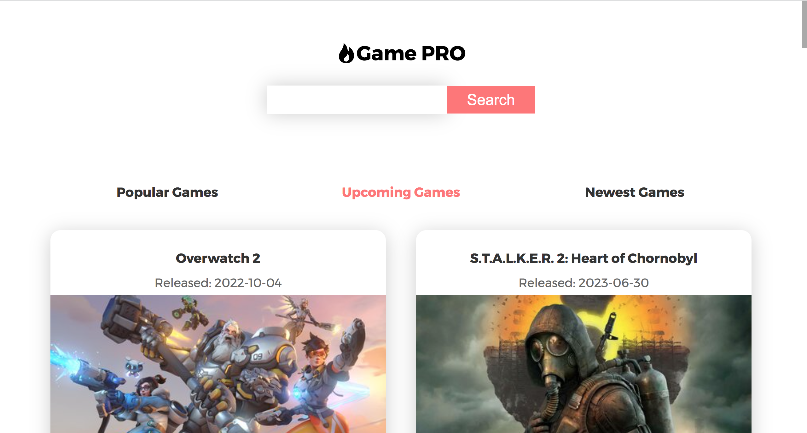
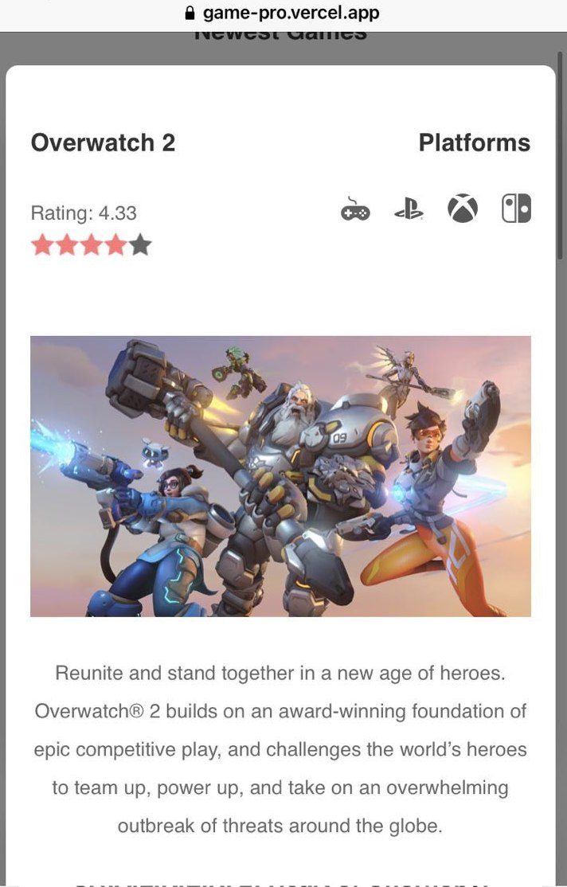

# Game PRO
Find your favorite games with this tiny react app and rawg.io API. React, Redux, Typescript, Styled-Components.

# Built with

# Tested with

# Screenshots

# Mobile

# Created by
Alex Kuzmenko
React Developer